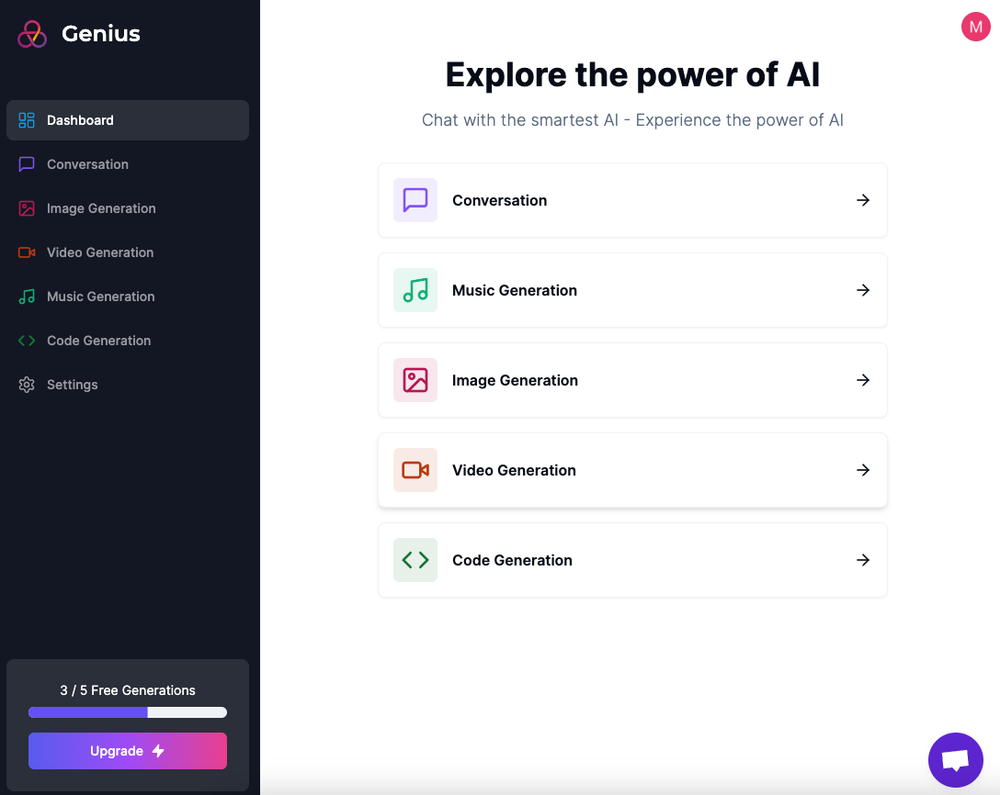

# Genius AI Tools Platform

## Features

- Tailwind design and animations
- Full responsiveness
- Clerk Authentication (Email, Google, 9+ Social Logins)
- Image Generation Tool (Open AI)
- Video Generation Tool (Replicate AI)
- Conversation Generation Tool (Open AI)
- Music Generation Tool (Replicate AI)
- Stripe monthly subscription
- Free tier with API limiting
- Database handling with Prisma
- Stripe integration for payment processing
- Crisp chat for real time customer support
- ...

## Prerequisites

- Node.js version 18.x.x

## Get Started

View a demo of this app [here](https://genius-ai-tools.vercel.app/).
